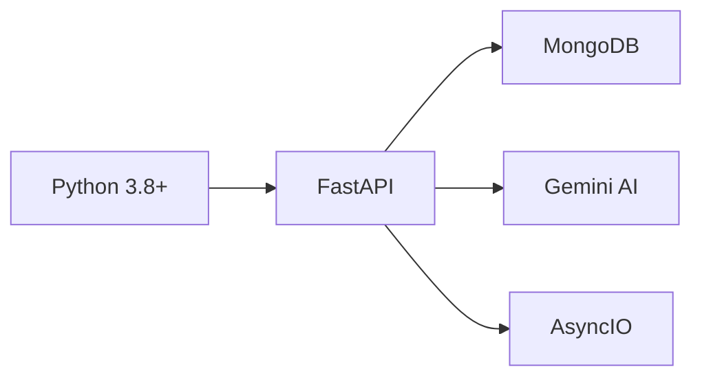
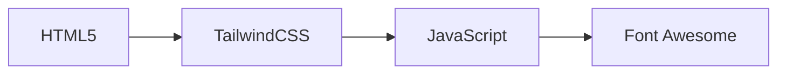
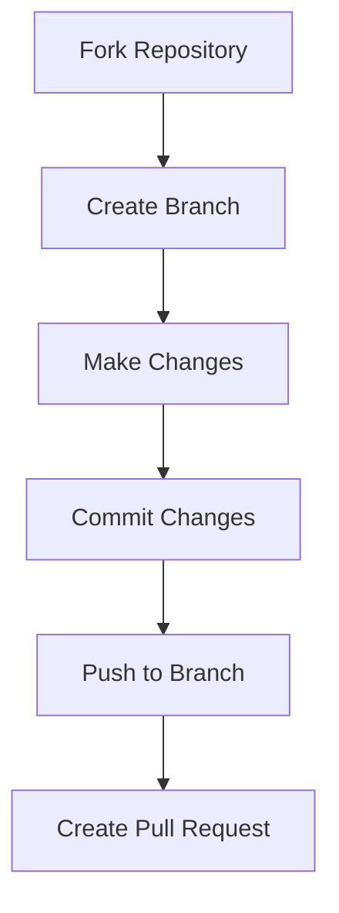

<div style="display: flex; align-items: center; justify-content: center; padding: 20px; background-color: #1e1e2f; color: white; height: 150px;">
    <h2>🎉 Transforming Remote Assessments with AI! 🎉</h2>
</div>

# AI-Based Proctoring System for Secure Assessments 🔒

[](https://www.python.org/)
[](https://fastapi.tiangolo.com/)
[](https://www.mongodb.com/atlas)
[](https://cloud.google.com/ai-platform)
[](https://tailwindcss.com/)
[](LICENSE)
[](CONTRIBUTING.md)
[](https://swoc.tech)
[](https://github.com/Hiteshydv001/Guard-AI/graphs/contributors)

<p align="center">
  An open-source initiative to transform remote assessment integrity using cutting-edge AI technology. </p>

[🌟 Features](#-features) •
[⚙️ Installation](#️-installation) •
[🏗️ Architecture](#️-architecture--design) •
[🚀 Usage](#-usage) •
[🤝 Contributing](#-contributing) •
[👥 Community](#-community)


---

## 🌟 Overview
This project introduces a cutting-edge **AI-powered proctoring system** designed to maintain **fairness**, **security**, and **integrity** in remote assessments. By leveraging advanced machine learning techniques, this system redefines how online tests are monitored.

## 📺 Project Demo

Watch our community demo:

[🎥 Watch Demo]()

---

## 🌟 Features

<table>
  <tr>
    <td>
      <h3>🤖 AI-Powered Monitoring</h3>
      <ul>
        <li>Eyeball and Lips Movement Detection</li>
        <li>Facial Emotion Recognition</li>
        <li>Screen and Audio Analysis</li>
      </ul>
      
    </td>
    <td>
      <h3>🔒 Device and Port Checks</h3>
      <ul>
        <li>Unauthorized device detection</li>
        <li>Port monitoring and anomaly detection</li>
        <li>Wi-Fi/Bluetooth signal analysis</li>
      </ul>
      
    </td>
  </tr>
</table>

## 🏗️ Architecture & Design

<table>
  <tr>
    <td>
      <h3>🎥 Screen and Audio Monitoring</h3>
      <ul>
        <li>Real-time screen activity analysis</li>
        <li>Speech-to-text conversion for audio validation</li>
      </ul>
      
    </td>
    <td>
      <h3>📶 Device and Network Monitoring</h3>
      <ul>
        <li>Wi-Fi and Bluetooth signal scanning</li>
        <li>Pattern recognition for unauthorized devices</li>
      </ul>
      
    </td>
  </tr>
</table>

---

### Priority Areas for Contribution
1. Database Integration

2. Features Integration

3. UI/UX Improvements

4. Features Development
   

## 🛣️ Project Roadmap

### Phase 1 (Current)


### Phase 2 (Upcoming)


### Phase 3 (Future)


## 🔧 Technology Stack

### Backend Infrastructure


### Frontend Technologies

## 🚀 Future Improvements

<table>
  <tr>
    <td>
      <h3>🧠 Enhanced Behavioral Analysis</h3>
      <ul>
        <li>Typing cadence detection</li>
        <li>Posture analysis for better behavior tracking</li>
      </ul>
      
    </td>
    <td>
      <h3>🔒 Blockchain for Data Integrity</h3>
      <ul>
        <li>Tamper-proof logs of proctoring sessions</li>
        <li>Improved transparency and data auditability</li>
      </ul>
      
    </td>
  </tr>
</table>

---

## ⚙️ Development Setup

1. Fork the repository.
2. Create a feature branch:
   ```bash
   git checkout -b feature-name
   ```
3. Commit your changes:
   ```bash
   git commit -m "Add your feature"
   ```
4. Push to the branch:
   ```bash
   git push origin feature-name
   ```
5. Open a pull request for review.

### Troubleshooting Common Issues

PUT SOME GENERAL POINTS HERE ALSO


## 📁 Project Structure
```
Guard AI/   CHANGE THESE WITH SAMPLE NAMES CHATGPT
├── 📜 main.py                    # FastAPI application entry point
├── 📁 .github/                   # GitHub specific files
│   └── ISSUE_TEMPLATE/          # Issue templates for contributions
├── 📁 static/                    # Static assets and files
├── 📁 templates/                 # HTML templates
├── 🔧 content_processor.py       # Content analysis and processing
├── 💾 database_setup.py          # Database initialization
├── 🖼️ image_processor.py         # Image processing module
├── 📊 image_data.py              # Image data structures
├── 🎥 video_processor.py         # Video processing module
├── 📊 video_data.py              # Video data structures
├── 🧪 test_image_processor.py    # Image processing tests
├── 🧪 test_video_processor.py    # Video processing tests
├── 📋 requirements.txt           # Project dependencies
├── 📝 README.md                  # Project documentation
├── 🔒 .env                       # Environment variables
└── 📝 .gitignore                # Git ignore rules
```
## 🚀 Usage

CHANGE THIS ALSO CHATGPT

1. Start the development server:
```bash
uvicorn main:app --reload
```

2. Access the application at `http://localhost:8000`

## 💡 API Endpoints
USE SOME GENERAL POINTS HERE ALSO

## 🤝 Contributing

We warmly welcome contributions from developers of all skill levels! Here's how you can help:



### 🎯 Good First Issues
- Look for issues tagged with `good-first-issue`
- Join our [community discussions](https://github.com/Hiteshydv001/Guard-AI/discussions/categories/general) for guidance

## 👥 Community

- 💬 Join our [Discord Server](https://discord.gg/pBasetQn)
- 🔗 Connect on [LinkedIn](www.linkedin.com/in/hitesh-kumar-aiml)
- 🐦 Follow us on [Twitter](https://x.com/Hitesh_0003)
- 📧 Contact maintainers: hiteshofficial0001@gmail.com

### 🌟 Contributors

Thanks to these wonderful people:

<a href="https://github.com/Varsha-1605/SocioSell/graphs/contributors">
  
</a>

## 📄 License

This project is licensed under the MIT License - see the [LICENSE](LICENSE) file for details.

## 🙏 Acknowledgments

- All our amazing contributors
- [Social Winter of Code](https://swoc.tech) for selecting our project
- [FastAPI](https://fastapi.tiangolo.com/)

---

<div align="center">

Made with ❤️ by the Guard AI Community

[⬆ Back to Top](#ai-based-proctoring-system-for-secure-assessments-)

</div>
