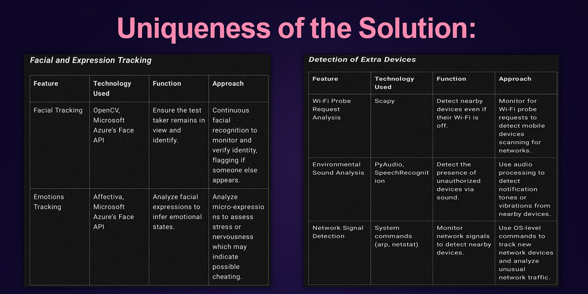
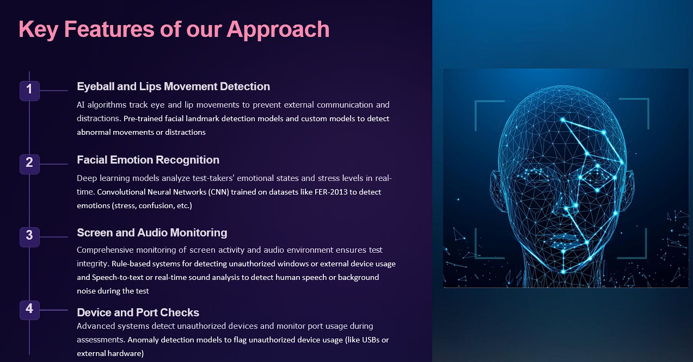
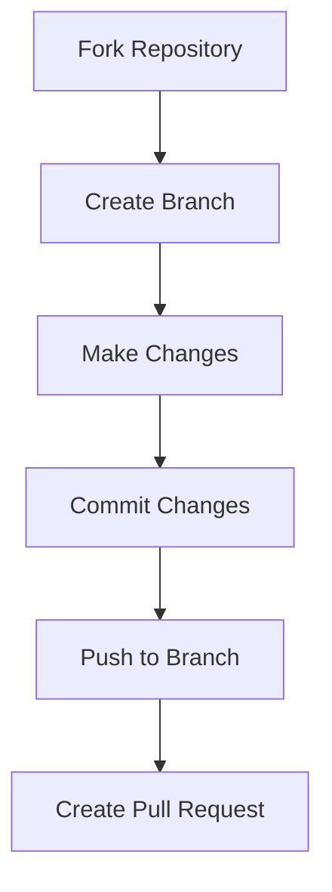

<div style="display: flex; align-items: center; justify-content: center; padding: 20px; background-color: #1e1e2f; color: white; height: 150px;">
    <h2>🎉 Transforming Remote Assessments with AI!!! 🎉</h2>
</div>

# `AI-Based Proctoring System for Secure Assessments 🔒`

[](https://www.python.org/)
[](https://fastapi.tiangolo.com/)
[](LICENSE)
[](CONTRIBUTING.md)
[](https://swoc.tech)
[](https://github.com/Hiteshydv001/Guard-AI/graphs/contributors)

<p align="center">
  An open-source initiative to transform remote assessment integrity using cutting-edge AI technology. </p>

[🌟 Features](#-features) 
[⚙️ Installation](#️-installation) 
[🏗️ Architecture](#️-architecture--design) 
[🚀 Usage](#-usage) 
[🤝 Contributing](#-contributing) 
[👥 Community](#-community)

---

<p align="center">
  
</p>

---

## Contributing Guide

Please refer to our [CONTRIBUTING.md](./CONTRIBUTING.md) for contribution guidelines.

---

## 📄 `Provide Your Feedback or Participate`

We value your feedback! Please take a moment to fill out the Google Form and contribute to improving our project.

[📋 Google Form - Participate Now!](https://docs.google.com/forms/d/e/1FAIpQLSdqqOSG82asLvwYaL6YfR35y2m6t_x_j7SHeS3W4636mzM-oQ/viewform?usp=dialog)

---

<table align="center">
    <thead align="center">
        <tr border: 1px;>
            <td><b>🌟 Stars</b></td>
            <td><b>🍴 Forks</b></td>
            <td><b>🐛 Issues</b></td>
            <td><b>🔔 Open PRs</b></td>
            <td><b>🔕 Close PRs</b></td>
        </tr>
     </thead>
    <tbody>
         <tr>
            <td></td>
             <td></td>
            <td></td>
            <td></td>
           <td></td>
        </tr>
    </tbody>
</table>
</div>


## 🌟 `Overview`
This project introduces a cutting-edge **AI-powered proctoring system** designed to maintain **fairness**, **security**, and **integrity** in remote assessments. By leveraging advanced machine learning techniques, this system redefines how online tests are monitored.

## 🏆 `Featured In`

<div align="center">

<table>
   <tr>
      <td></td>
      <td>Social Winter Of Code</td>
      <td>Social Winter of Code is an initiative to introduce students to the open-source world, fostering collaboration and development.</td>
   </tr>
   <tr>
      <td></td>
      <td>Delta Winter Of Code</td>
      <td>Delta Winter of Code empowers students by providing opportunities to contribute to meaningful open-source projects and grow their skills.</td>
   </tr>
    <tr>
      <td></td>
      <td>JWOC Winter of Code</td>
      <td>JWoC provides a fully immersive learning experience for students and first-time contributors by promoting the wonders of open-source software and crafting a community of new and experienced technical developers. The best projects are selected for this program. Students get acquainted with the projects from the mentors during the Community Bonding Period. Students work on these projects during the coding phase. At the end of the coding period, the winners of the programs are announced on the basis of their contribution in terms of quantity as well as quality.</td>
   </tr>
</table>


</div>


## 📺 `Project Demo`

Watch our community demo:

[🎥 Watch Demo]()

---

## `🌟 Features`

<table>
  <tr>
    <td>
      <h3>🤖 AI-Powered Monitoring</h3>
      <ul>
        <li>Eyeball and Lips Movement Detection</li>
        <li>Facial Emotion Recognition</li>
        <li>Screen and Audio Analysis</li>
      </ul>
    </td>
    <td>
      <h3>🔒 Device and Port Checks</h3>
      <ul>
        <li>Unauthorized device detection</li>
        <li>Port monitoring and anomaly detection</li>
        <li>Wi-Fi/Bluetooth signal analysis</li>
      </ul>
    </td>
  </tr>
</table>

## `🏗️ Architecture & Design`

<table>
  <tr>
    <td>
      <h3>🎥 Screen and Audio Monitoring</h3>
      <ul>
        <li>Real-time screen activity analysis</li>
        <li>Speech-to-text conversion for audio validation</li>
      </ul>
    </td>
    <td>
      <h3>📶 Device and Network Monitoring</h3>
      <ul>
        <li>Wi-Fi and Bluetooth signal scanning</li>
        <li>Pattern recognition for unauthorized devices</li>
      </ul>
    </td>
  </tr>
</table>

---

### `Key Features and Uniqueness`






## `Added Features`

#### `Gaze Tracker`


### `Priority Areas for Contribution`

1. Database Integration

2. Features Integration

3. UI/UX Improvements

4. Features Development
   

## `🛣️ Project Roadmap`

### Phase 1 (Current)


### Phase 2 (Upcoming)


### Phase 3 (Future)


## `🔧 Technology Stack`

### `Backend Infrastructure`


### `Frontend Technologies`


## `🚀 Future Improvements`

<table>
  <tr>
    <td>
      <h3>🧠 Enhanced Behavioral Analysis</h3>
      <ul>
        <li>Typing cadence detection</li>
        <li>Posture analysis for better behavior tracking</li>
      </ul>
    </td>
    <td>
      <h3>🔒 Blockchain for Data Integrity</h3>
      <ul>
        <li>Tamper-proof logs of proctoring sessions</li>
        <li>Improved transparency and data auditability</li>
      </ul>
    </td>
  </tr>
</table>


---

## `⚙️ Development Setup`

1. Fork the repository.
2. Create a feature branch:
   ```bash
   git checkout -b feature-name
   ```
3. Commit your changes:
   ```bash
   git commit -m "Add your feature"
   ```
4. Push to the branch:
   ```bash
   git push origin feature-name
   ```
5. Open a pull request for review.

### `Troubleshooting Common Issues`


## `📁 Project Structure`

```
Directory structure:
└── hiteshydv001-guard-ai-designing-remote-proctoring-system/
    ├── README.md
    ├── CONTRIBUTING.md
    ├── index.html
    ├── lips_movement_detection.py
    ├── server.py
    ├── GazeTracking/
    │   ├── example.py
    │   ├── requirements.txt
    │   └── gaze_tracking/
    │       ├── __init__.py
    │       ├── calibration.py
    │       ├── eye.py
    │       ├── gaze_tracking.py
    │       ├── pupil.py
    │       └── trained_models/
    │           └── shape_predictor_68_face_landmarks.dat
    ├── HeadPoseDetect/
    │   ├── README.md Head_Tracking
    │   ├── head_app.py
    │   ├── head_pose_detection.py
    │   └── index2.html
    ├── HeadPoseEstimation/
    │   ├── README.md
    │   ├── anomaly_detection.py
    │   ├── demo.py
    │   ├── face_detection.py
    │   ├── face_landmarker.py
    │   ├── face_landmarker.task
    │   ├── head_pose_estimation.py
    │   ├── requirements.txt
    │   ├── session.py
    │   ├── yolov11n-face.pt
    │   ├── Suspicious Activity/
    │   │   └── User1/
    │   │       ├── 2025-01-08/
    │   │       │   └── 19_54_13/
    │   │       │       ├── logs.json
    │   │       │       └── Captures/
    │   │       │           ├── Frequent Head Movement/
    │   │       │           ├── More than 1 face/
    │   │       │           ├── No face/
    │   │       │           └── Prolonged Looking Away/
    │   │       ├── 2025-01-09/
    │   │       │   ├── 11_30_40/
    │   │       │   │   ├── logs.json
    │   │       │   │   └── Captures/
    │   │       │   │       ├── Frequent Head Movement/
    │   │       │   │       ├── More than 1 face/
    │   │       │   │       ├── No face/
    │   │       │   │       └── Prolonged Looking Away/
    │   │       │   └── 11_38_04/
    │   │       │       ├── logs.json
    │   │       │       └── Captures/
    │   │       │           ├── Frequent Head Movement/
    │   │       │           ├── More than 1 face/
    │   │       │           ├── No face/
    │   │       │           └── Prolonged Looking Away/
    │   │       └── 2025-01-12/
    │   │           └── 22_50_36/
    │   │               ├── logs.json
    │   │               └── Captures/
    │   │                   ├── Frequent Head Movement/
    │   │                   ├── More than 1 face/
    │   │                   └── Prolonged Looking Away/
    │   └── templates/
    │       ├── calibrate.html
    │       ├── hello.html
    │       ├── index.html
    │       ├── proctering_screen.html
    │       └── stop_proctering.html
    ├── assets/
    │   ├── css/
    │   │   └── styles.css
    │   ├── img/
    │   ├── js/
    │   │   └── main.js
    │   └── scss/
    │       └── styles.scss
    ├── backend-proctoring/
    │   ├── README.md
    │   ├── package-lock.json
    │   ├── package.json
    │   ├── tsconfig.json
    │   ├── .env.example
    │   ├── .gitignore
    │   ├── prisma/
    │   │   ├── schema.prisma
    │   │   └── migrations/
    │   │       ├── migration_lock.toml
    │   │       ├── 20250102012215_init/
    │   │       │   └── migration.sql
    │   │       ├── 20250102104616_init/
    │   │       │   └── migration.sql
    │   │       ├── 20250102104943_init/
    │   │       │   └── migration.sql
    │   │       ├── 20250102111739_init/
    │   │       │   └── migration.sql
    │   │       ├── 20250102113050_init/
    │   │       │   └── migration.sql
    │   │       ├── 20250102145210_add_tab_change_and_heartbeat_logs/
    │   │       │   └── migration.sql
    │   │       ├── 20250103204652_add_chat_message_model/
    │   │       │   └── migration.sql
    │   │       ├── 20250103221011_updated_enums_and_roles/
    │   │       │   └── migration.sql
    │   │       └── 20250104022816_/
    │   │           └── migration.sql
    │   └── src/
    │       ├── server.ts
    │       ├── auth/
    │       │   └── Auth.ts
    │       ├── config/
    │       │   └── jwt.ts
    │       ├── constants/
    │       │   └── user.constants.ts
    │       ├── controllers/
    │       │   ├── auth.controller.ts
    │       │   ├── exam.controller.ts
    │       │   ├── organisation.controller.ts
    │       │   ├── proctor.controller.ts
    │       │   └── user.controller.ts
    │       ├── middleware/
    │       │   └── auth.ts
    │       ├── modules/
    │       │   ├── auth/
    │       │   │   └── auth.service.ts
    │       │   ├── exams/
    │       │   │   └── exam.service.ts
    │       │   ├── organisation/
    │       │   │   └── organisation.service.ts
    │       │   ├── proctoring/
    │       │   │   └── proctor.service.ts
    │       │   └── users/
    │       │       └── user.service.ts
    │       ├── routes/
    │       │   ├── auth.routes.ts
    │       │   ├── exam.routes.ts
    │       │   ├── organisation.routes.ts
    │       │   ├── proctor.routes.ts
    │       │   └── user.routes.ts
    │       ├── types/
    │       │   └── express/
    │       │       └── index.d.ts
    │       ├── utils/
    │       │   ├── errorResponse.ts
    │       │   └── passwordHash.ts
    │       └── websockets/
    │           └── websocket.ts
    ├── demo/
    ├── main-web-vecel/
    │   ├── components.json
    │   ├── middleware.ts
    │   ├── next.config.mjs
    │   ├── package-lock.json
    │   ├── package.json
    │   ├── postcss.config.mjs
    │   ├── tailwind.config.ts
    │   ├── tsconfig.json
    │   ├── .eslintrc.json
    │   ├── .gitignore
    │   ├── app/
    │   │   ├── globals.css
    │   │   ├── layout.tsx
    │   │   ├── (root)/
    │   │   │   ├── loading.tsx
    │   │   │   ├── page.tsx
    │   │   │   ├── candidate/
    │   │   │   │   └── page.tsx
    │   │   │   └── proctor/
    │   │   │       └── page.tsx
    │   │   ├── Signin/
    │   │   │   └── [[...sign-in]]/
    │   │   │       └── page.tsx
    │   │   └── Signup/
    │   │       └── [[...sign-up]]/
    │   │           └── page.tsx
    │   ├── components/
    │   │   ├── icons/
    │   │   │   ├── discord-icon.tsx
    │   │   │   ├── github-icon.tsx
    │   │   │   ├── linkedin-icon.tsx
    │   │   │   └── x-icon.tsx
    │   │   ├── layout/
    │   │   │   ├── navbar.tsx
    │   │   │   ├── theme-provider.tsx
    │   │   │   ├── toogle-theme.tsx
    │   │   │   ├── usealert.tsx
    │   │   │   └── sections/
    │   │   │       ├── benefits.tsx
    │   │   │       ├── community.tsx
    │   │   │       ├── contact.tsx
    │   │   │       ├── faq.tsx
    │   │   │       ├── features.tsx
    │   │   │       ├── footer.tsx
    │   │   │       ├── hero.tsx
    │   │   │       ├── pricing.tsx
    │   │   │       ├── services.tsx
    │   │   │       ├── sponsors.tsx
    │   │   │       ├── team.tsx
    │   │   │       └── testimonial.tsx
    │   │   └── ui/
    │   │       ├── accordion.tsx
    │   │       ├── alert.tsx
    │   │       ├── avatar.tsx
    │   │       ├── badge.tsx
    │   │       ├── button.tsx
    │   │       ├── card.tsx
    │   │       ├── carousel.tsx
    │   │       ├── collapsible.tsx
    │   │       ├── form.tsx
    │   │       ├── icon.tsx
    │   │       ├── input.tsx
    │   │       ├── label.tsx
    │   │       ├── navigation-menu.tsx
    │   │       ├── scroll-area.tsx
    │   │       ├── select.tsx
    │   │       ├── separator.tsx
    │   │       ├── sheet.tsx
    │   │       └── textarea.tsx
    │   ├── lib/
    │   │   └── utils.ts
    │   ├── public/
    │   │   └── proctor-animation.json
    │   └── .vscode/
    │       └── settings.json
    └── .github/
        ├── ISSUE_TEMPLATE/
        │   ├── bug_report.md
        │   ├── custom.md
        │   └── feature_request.md
        └── workflows/
            └── static.yml

```

## `🚀 Usage`


## `🤝 Contributing`

We warmly welcome contributions from developers of all skill levels! Here's how you can help:



### `🎯 Good First Issues`
- Look for issues tagged with `good-first-issue`
- Join our [community discussions](https://github.com/Hiteshydv001/Guard-AI/discussions/categories/general) for guidance

## `👥 Community`

- 💬 Join our [Discord Server](https://discord.gg/pBasetQn)
- 🔗 Connect on [LinkedIn](https://www.linkedin.com/in/hitesh-kumar-aiml/)
- 🐦 Follow us on [Twitter](https://x.com/Hitesh_0003)
- 📧 Contact maintainers: hiteshofficial0001@gmail.com

### `🌟 Contributors`

Thanks to these wonderful people:

<a href="https://github.com/Hiteshydv001/Guard-AI/graphs/contributors">
  
</a>

## `📄 License`

This project is licensed under the MIT License - see the [LICENSE](LICENSE) file for details.

## `🙏 Acknowledgments`

- All our amazing contributors
- [Social Winter of Code](https://swoc.tech) for selecting our project
- [FastAPI](https://fastapi.tiangolo.com/)

---

<div align="center">

Made with ❤️ by the Guard AI Community

[⬆ Back to Top](#ai-based-proctoring-system-for-secure-assessments-)

</div>
